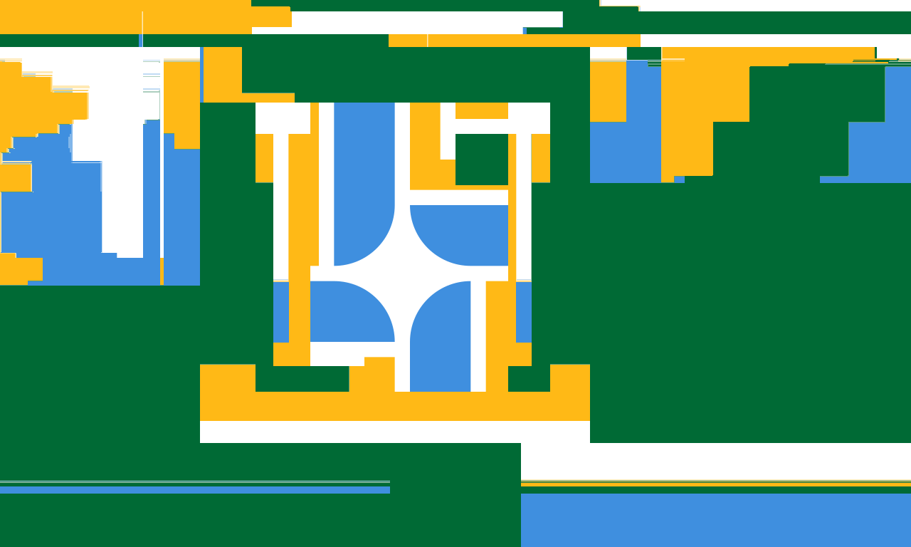
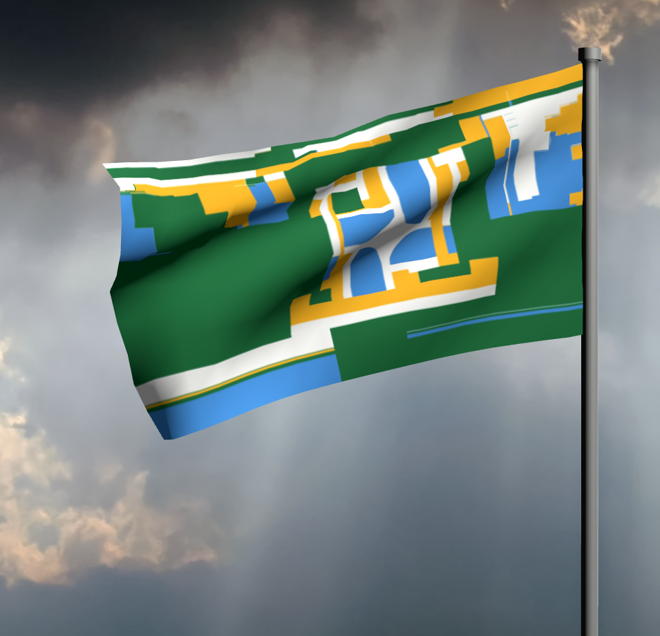
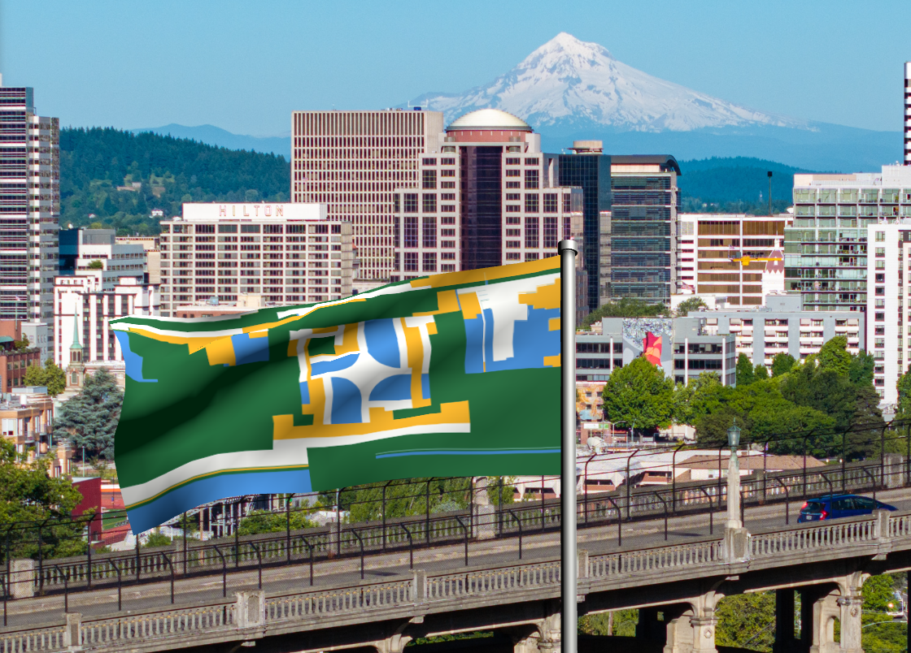
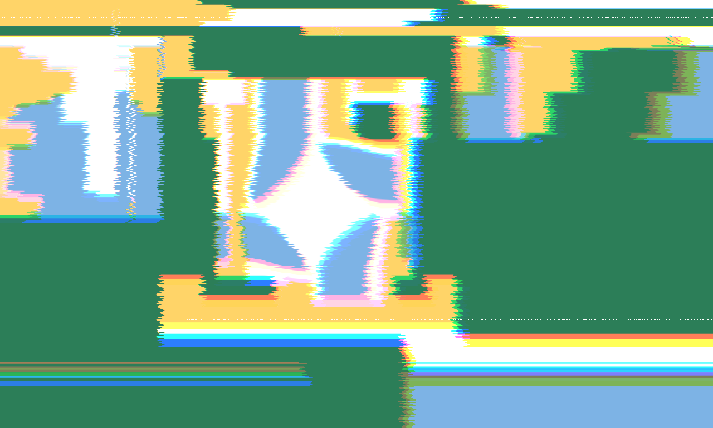

# Attributions

Best attempt at attributing all the resources used on this site.

## Glitched Flag

Grabbed the PNG preview of the [Portland Flag SVG from Wikipedia](https://commons.wikimedia.org/wiki/File:Flag_of_Portland,_Oregon.svg).

Used https://pixel-sorter.com/ with a mask around the center, glitching and widening the mask repeatedly.

Then took that into [krikienoid's Flagwaver](https://krikienoid.github.io/flagwaver/) and took some screenshots both with the default background and with [wikimedia Portland_Oregon_Aerial,\_June_2024.jpg](https://commons.wikimedia.org/wiki/File:Portland_Oregon_Aerial,_June_2024.jpg)

Took the glitched flag into [photofilters.net](https://www.photofilters.com/) and went crazy:

Made a smaller version of the glitched flag in GIMP, then brought that into [realfavicongenerator.net](https://realfavicongenerator.net/ "Favicon generator. For real.") to make the favicon version.

## Missing CSS

Started with Missing.css - https://missing.style/

## Colors

Started with colors of the Portland flag, then used https://www.tints.dev/palette/ to generate "full palettes" with the many steps of the colors.
